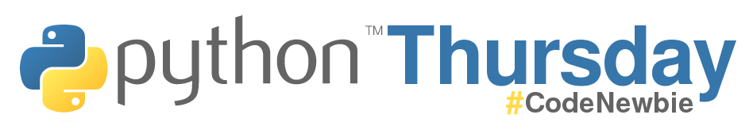
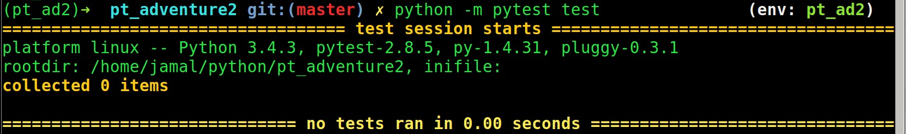

# Welcome to the Python Thursday Adventure v2!
The sequel to the 2015 favorite, [Python Thursday Adventure](https://github.com/code-newbies/python-thursday-adventure).

This is the project for the CodeNewbie Python Thursday group. You can join the group [on Slack](https://codenewbie.typeform.com/to/uwsWlZ). To get started, read the following, and if you get stuck, reach out to Jamal (github: @jamalhansen, slack: @jamal) the host.


### About this project
To start out, we are building a command line game to help us develop our Python skills (and review OOP principles). We meet weekly [on Slack](https://codenewbie.typeform.com/to/uwsWlZ) in the "python-thursday" channel on Thursday at 9PM EST, so mark your calendars and stop by! There, we'll review the project, look at code together, and share what we learned.

In particular, we hope to:

- collaborate and learn together
- turn feature requirements into actual product features!
- get code reviewed by community members
- get experience working on a real app in a collaborative, real-world setting

## Getting Started

### Tech requirements
You'll need to have installed Python 3 to begin. The TL;DR instructions: head to [python.org](https://www.python.org/downloads/), download and install the latest 3.x.x version for your operating system. For more detailed instructions, links are provided below.

- Mac: [here](http://www.diveintopython3.net/installing-python.html#macosx) or [here](http://en.wikibooks.org/wiki/Non-Programmer%27s_Tutorial_for_Python_3/Intro#Mac_users)

- Linux: [here](http://www.diveintopython3.net/installing-python.html#ubuntu) or [here](http://en.wikibooks.org/wiki/Non-Programmer%27s_Tutorial_for_Python_3/Intro#Linux.2C_BSD.2C_and_Unix_users)

- Windows: [here](http://www.diveintopython3.net/installing-python.html#windows) or [here](http://en.wikibooks.org/wiki/Non-Programmer%27s_Tutorial_for_Python_3/Intro#Windows_users)

**Note**: For Windows users, there is the extra step of setting your PATH variable. You can either do it from the GUI interface of the Windows installer from Python.org (recommended!), or using the command line [(instructions).](http://en.wikibooks.org/wiki/Non-Programmer%27s_Tutorial_for_Python_3/Intro#Configuring_your_PATH_environment_variable)

### How to contribute
We use pull requests so you can get your code reviewed by others before merging it into the project. Code reviews are a great way to learn and collaborate. Here's how the process works:

1. Join our [Slack community](https://codenewbie.typeform.com/to/uwsWlZ) and tell your host @phillipg you want to join the project repo
2. The host will invite you to join as a collaborator. You **MUST** be a collaborator to join the project and pick up features.
3. Accept invite from Github to join as a collaborator.
- Look through the issues list and pick a feature you want to work on.
- Assign that feature to yourself.
- Clone this repo.
- Make a feature branch for the issue you're working on. The first part of the branch name should be your initials, like this: `sy-allows-users-to-update-avatar`
- Push your branch to origin.
- When your feature is done and ready to be reviewed, make pull request.
- Copy and paste your pull request link to the \#python-thursday Slack channel for review.
- Once you get some feedback on your pull request and a final thumbs up from a community member, merge to master & close the branch.

### Quick Start Guide

Once you have install Python 3 and have joined CodeNewbie Python Thursday you will need to do a little more setup to get the project up and running on your system.  This setup will be done on the command line so open up a terminal and get started.

#### Clone the source to your computer

Copy the code from github to your pc with the clone command.  The following example assumes that you have [ssh setup with your github account](https://help.github.com/articles/generating-ssh-keys/).

```git clone git@github.com:code-newbies/python-thursday-adventure-2.git pta2```

If you do not want to use SSH you can use the following command instead

```git clone https://github.com/code-newbies/python-thursday-adventure-2.git pta2```

Once the repo is cloned, move into the closed repository with the following

```cd pta2```

#### Setup a virtual environment

Next you will probably want to setup a virtual environment for Python 3.  This is not absolutely necessary but it can help to make using Python 3 and this project more straightforward.

If you have not installed the Python module mkvirtualenv, it will make this process easy.  To install this module with pip use:

```pip install mkvirtualenv```

**Note**: If you are using Linux or a Mac you may need to use *sudo* before the previous command.

Now that it is installed you can create a virtual Python environment using Python 3 with the following command.

```mkvirtualenv -p /usr/bin/python3 pta2 ```

The above command makes a virtual environment named pta2 that uses Python 3.  When you want to exit this environment use the command ```deactivate```.  When you want to work on the environment again use ```workon pta2```.

**Note**: If you are using Windows the location */usr/bin/python3* will not be valid.  Replace this value with the location of your Python 3.

#### Install the requirements for the project

The final step to setup the project is to install the required modules.  These are stored in the file requirements.txt and can be installed with pip using the following command.

```pip install -r requirements.txt```

### Starting an issue

When you are ready to start working on an issue you will want to create a feature branch. This is done with the following command:

```git checkout -b <branch name>```

where <branch name> is your initals and a short description of your issue.  For instance *jh-fixes-flux-capacitor*

### Come to Python Thursday!
Join us at 9PM EST on Thursday to review code and talk about the project. Come with questions, code to show, and be ready to share what you're learning!

## Community rules & guidelines
The purpose of this project is to learn by working on a real-world application. Use the code reviews as a place to ask questions, offer suggestions, and share your thoughts. When giving feedback, particularly on code reviews, please remember our community rules: be nice, be honest, be supportive. We're all learning, so let's make sure to be kind to one another.

For more details, see our full Code of [Conduct](http://www.codenewbie.org/blogs/our-code-of-conduct). We're excited to learn with you :)


## Dependencies
Dependencies are managed for this project with pip.  Basic proceedures for installing and saving dependencies is below, additional information can be found in the [pip documentation](https://pip.readthedocs.org/en/1.1/requirements.html#).

### Installing

The dependencies for this project are stored in the file requirements.txt.  To install these dependencies into your environment use the command below.

```pip install -r requirements.txt```

### Saving

If you have added new dependencies to the project, please add them to the requirements.txt file. You can do this with ```pip freeze > requirements.txt``` which will save your current requirements to the requirements.txt file.

## Testing

### Test setup

Before running tests you will need to use pip to install the Python Adventure in editable mode.  You can do this by typing the following from the root directory of the project ```pip install -e .```

### Running unit tests

Running unit tests can be achieved by running pytest from the command line and passing it the location of the tests to run.  This can be done with the following command run from the root folder of the project ```python -m pytest test/```

Running your tests should looks something similar to this:



## Additional Resources

Below are some additonal links and resources that you may find helpful.

### Git and Github

You'll also need a Github account and some knowledge of git. If you're not comfortable using git, that's perfectly fine! Start by looking at the following resources:

- [Github For Beginners: Don't Get Scared, Get Started](http://readwrite.com/2013/09/30/understanding-github-a-journey-for-beginners-part-1)
An incredibly newbie-friendly introduction to the world of git and Github. Written by a non-developer, it's a great introduction to many of the common terms and concepts.

- [Github For Beginners: Commit, Push and Go](http://readwrite.com/2013/10/02/github-for-beginners-part-2)
Part two of the above article, this post takes you through setting up a git repo and performing common commands in your repo. Open up your terminal and follow along to get the most out of this post.

- [Try Git](https://try.github.io/levels/1/challenges/1)
This course from Code School lets you try  git from the browser. It's an easy way to practice the commands you'll use for the Python Thursday project.

- [Feature Branch Workflow](https://www.atlassian.com/git/tutorials/comparing-workflows/feature-branch-workflow)
We'll be using the Feature Branch Workflow for these projects. This is a great blog post filled with awesome diagrams that show you how it works. Once you've familiarized yourself with git and Github, read through this to see how we'll use it in this collaborative setting.

- **Have more git questions?** If you've gone through the material above and want to walk through git concepts with a real person, contact the CodeNewbies at Python Thursday and we'd be happy to setup some time to do it together.

## Python

You're welcome to start contributing at any level, but it's helpful to have some knowledge of Python. To get you started, go through one of the following tutorials first.

- [Python 3 Cheat Sheet](http://learnxinyminutes.com/docs/python3/)
  If you're coming from another programming language, or you're pretty solid with Python 2, this single page has syntax examples to get you up and running fast in Python 3.

- [Non-Programmer's Tutorial for Python 3](http://en.wikibooks.org/wiki/Non-Programmer%27s_Tutorial_for_Python_3)

- [How To Think Like A Computer Scientist (Python 3)](http://interactivepython.org/runestone/static/thinkcspy/toc.html)

- [Dive Into Python 3](http://www.diveintopython3.net)

- [Test Driven Development with Python](http://chimera.labs.oreilly.com/books/1234000000754/index.html)... Also referred to as "The Goat Book"

Once you're done, come back and get your code on!

There's a big gap between the knowledge you gain when you go through the tutorials, and the skills you need to be job ready. We hope to help fill that gap by working on collaborative projects like this. So if you're tired of doing tutorials and you're looking for some real-world experience, this is for you.

